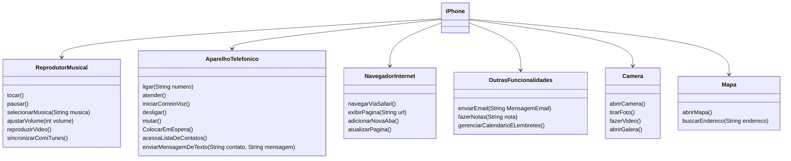

## Desafio Modelagem e Diagramação de um Componente iPhone
# Objetivo 
Modelar e diagramar a representação UML do componente iPhone, abrangendo suas funcionalidades como Reprodutor Musical, Aparelho Telefônico, Navegador na Internet, Camera, Mapa

## Diagrama UML

### Implementação em Java está na pasta SRC
